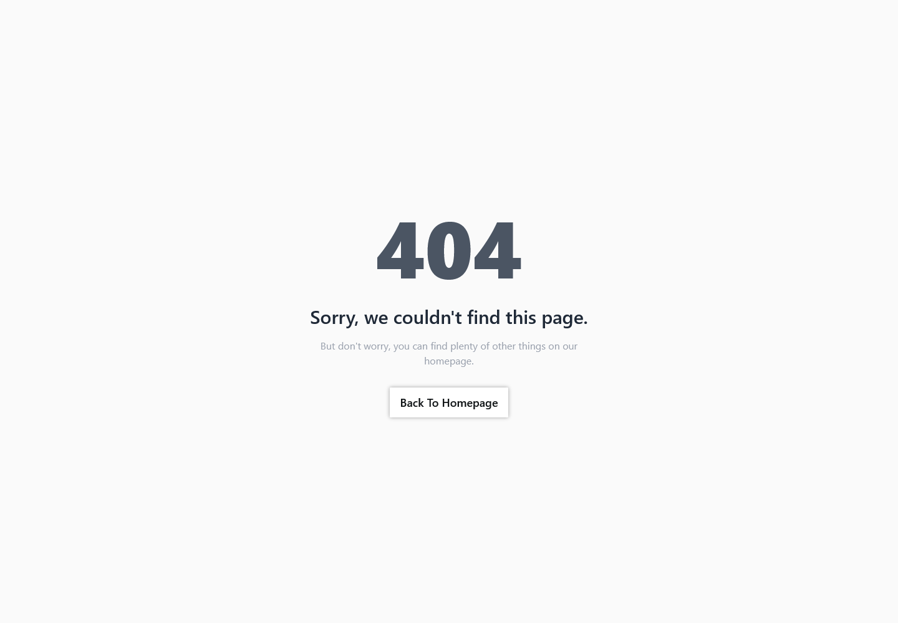

# Frontend Mentor - REST Countries API with color theme switcher solution

This is a solution to the
[REST Countries API with color theme switcher challenge on Frontend Mentor](https://www.frontendmentor.io/challenges/rest-countries-api-with-color-theme-switcher-5cacc469fec04111f7b848ca).
Frontend Mentor challenges help you improve your coding skills by building
realistic projects.

## Table of contents

-   [Overview](#overview)
    -   [The challenge](#the-challenge)
    -   [Screenshot](#screenshot)
    -   [Links](#links)
-   [My process](#my-process)
    -   [Built with](#built-with)
-   [Author](#author)

## Overview

### The challenge

Users should be able to:

-   See all countries from the API on the homepage
-   Search for a country using an `input` field
-   Filter countries by region
-   Click on a country to see more detailed information on a separate page
-   Click through to the border countries on the detail page
-   Toggle the color scheme between light and dark mode _(optional)_

### Screenshot

| Desktop                                      | Mobile                                      |
| -------------------------------------------- | ------------------------------------------- |
| Home Page: Light                             |                                             |
|          |          |
| Home Page: Dark                              |                                             |
|           |           |
| Details Page: Light                          |                                             |
|  |  |
| Details Page: Dark                           |                                             |
|   |   |
| 404 Page: Light                              |                                             |
|               |      |
| 404 Page: Dark                               |                                             |
|                |       |

### Links

-   [Solution](https://github.com/ShivangamSoni/where-in-the-world)
-   [Live Site](https://shivi-where-in-the-world.netlify.app/)

## My process

### Built with

-   HTML5
-   CSS3
-   [TypeScript](https://www.typescriptlang.org/)
-   [TailwindCSS](https://tailwindcss.com/) - For Styles
-   [DaisyUI](https://daisyui.com/)
-   [React](https://react.dev/) - UI library
-   [Vite](https://vitejs.dev/) - For Development & Project Bundling
-   [React Router DOM](https://reactrouter.com/en/main) - SPA Routing
-   [@reduxjs/toolkit](https://redux-toolkit.js.org/) - Global State Management
-   [@tanstack/react-query](https://tanstack.com/query/latest) - Asynchronous
    State Management
-   [React-Icons](https://react-icons.github.io/react-icons/)

## Author

-   [Shivangam Soni](https://shivangam-soni.vercel.app/)
-   Frontend Mentor -
    [@ShivangamSoni](https://www.frontendmentor.io/profile/ShivangamSoni)
-   GitHub - [@ShivangamSoni](https://github.com/ShivangamSoni)
